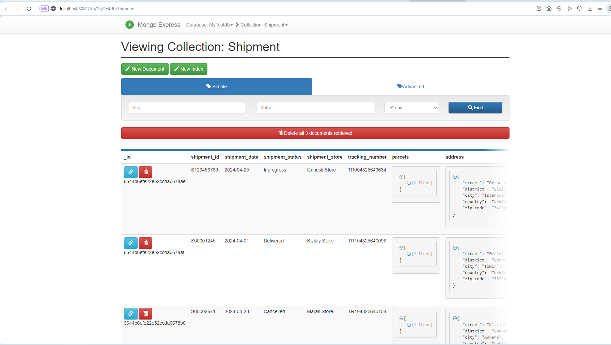

## Running apache airflow 2.9 in docker with local executor.
Here are the steps to take to get airflow 2.9 running with docker on your machine. 
1. Clone this repo

1.1 Run this project requirements
```bash
python.exe -m pip install --upgrade pip
```
```bash
pip install --no-cache-dir -r requirements.txt
```
2. Install docker desktop application if you don't have docker running on your machine
- [Download Docker Desktop Application for Mac OS](https://hub.docker.com/editions/community/docker-ce-desktop-mac)
- [Download Docker Desktop Application for Windows](https://hub.docker.com/editions/community/docker-ce-desktop-windows)
3. Launch airflow by docker-compose
```bash
docker-compose up -d
```
3.1 Check the running containers
```bash
docker ps
```
1. Open browser and type http://localhost:8080 to launch the airflow webserver ->
Username: airflow
Password: airflow


2. Open browser and type http://localhost:8081 to launch the mongo-express ->
Username: admin
Password: pass



3. Open browser and type http://localhost:5050 to launch the PgAdmin ->
Username: pgadmin4@pgadmin.org (as a default)
Password: admin (as a default)

Port 5432
Username  default: postgres
Password  default postgres


